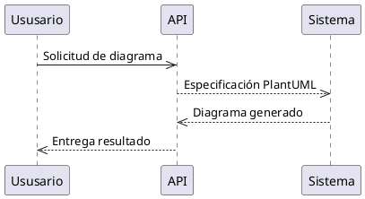

### Descripción
Genera y valida diagramas UML Site y Sequence mediante PlantUML, integrado con la Api OpenAPI.

### Funcionalidades
- Conversión automática de específicaciones OpenAPI a diagramas
- Validación syntax-semántica de PlantUML
- Exportación automática en formato HTML/Viewable
- Integración con docs/history/

### Estructura de Disposición

### Uso Básico
1. `npm run generate-uml -- --spec=contracts/openapi/commands.yaml --type=sequence`
2. Revisión en Jester para validación de calidad

### Requisitos
- PlantUML 5.0 instalado (vía [eplot](https://eplot.plantuml.com/))
- Permisos de escritura en .opencode/agent/
- API OpenAPI actualizada en contracts/openapi/

### Historico
- Sistema de generación Based on: Oscar's Orchestration Protocol (v1.2)
- Validación basada en Jester's QA Framework